---
## Front matter
title: "Отчёт по лабораторной работе №2"
subtitle: "Дисциплина:архитуктура компьютера"
author: "Елизавета Александровна Киселева"

## Generic otions
lang: ru-RU
toc-title: "Содержание"

## Bibliography
bibliography: bib/cite.bib
csl: pandoc/csl/gost-r-7-0-5-2008-numeric.csl

## Pdf output format
toc: true # Table of contents
toc-depth: 2
lof: true # List of figures
lot: true # List of tables
fontsize: 12pt
linestretch: 1.5
papersize: a4
documentclass: scrreprt
## I18n polyglossia
polyglossia-lang:
  name: russian
  options:
	- spelling=modern
	- babelshorthands=true
polyglossia-otherlangs:
  name: english
## I18n babel
babel-lang: russian
babel-otherlangs: english
## Fonts
mainfont: IBM Plex Serif
romanfont: IBM Plex Serif
sansfont: IBM Plex Sans
monofont: IBM Plex Mono
mathfont: STIX Two Math
mainfontoptions: Ligatures=Common,Ligatures=TeX,Scale=0.94
romanfontoptions: Ligatures=Common,Ligatures=TeX,Scale=0.94
sansfontoptions: Ligatures=Common,Ligatures=TeX,Scale=MatchLowercase,Scale=0.94
monofontoptions: Scale=MatchLowercase,Scale=0.94,FakeStretch=0.9
mathfontoptions:
## Biblatex
biblatex: true
biblio-style: "gost-numeric"
biblatexoptions:
  - parentracker=true
  - backend=biber
  - hyperref=auto
  - language=auto
  - autolang=other*
  - citestyle=gost-numeric
## Pandoc-crossref LaTeX customization
figureTitle: "Рис."
tableTitle: "Таблица"
listingTitle: "Листинг"
lofTitle: "Список иллюстраций"
lotTitle: "Список таблиц"
lolTitle: "Листинги"
## Misc options
indent: true
header-includes:
  - \usepackage{indentfirst}
  - \usepackage{float} # keep figures where there are in the text
  - \floatplacement{figure}{H} # keep figures where there are in the text
---

# Цель работы

Целью данной лабораторной работы является изучить идеологию и применение средств контроля версий. Приобрести практические навыки по работе с системой git. 

# Задание

1. Настройка GitHub.
2. Базовая настройка Git.
3. Создание SSH-ключа.
4. Создание рабочего пространства и репозитория курса на основе шаблона.
5. Создание репозитория курса на основе шаблона.
6. Настройка каталога курса.
7. Выполнение заданий для самостоятельной работы.

# Теоретическое введение

Системы контроля версий (Version Control System, VCS) применяются при работе нескольких человек над одним проектом. Обычно основное дерево проекта хранится в локальном или удалённом репозитории, к которому настроен доступ для участников проекта. При внесении изменений в содержание проекта система контроля версий позволяет их фиксировать, совмещать изменения, произведённые разными участниками проекта, производить откат к любой более ранней версии проекта, если это требуется. В классических системах контроля версий используется централизованная модель, предполагающая наличие единого репозитория для хранения файлов. Выполнение большинства функций по управлению версиями осуществляется специальным сервером. Участник проекта (пользователь) перед началом работы посредством определённых команд получает нужную ему версию файлов. После внесения изменений пользователь размещает новую версию в хранилище. При этом предыдущие версии не удаляются из центрального хранилища и к ним можно вернуться в любой момент. Сервер может сохранять не полную версию изменённых файлов, а производить так называемую дельта-компрессию — сохранять только изменения между последовательными версиями, что позволяет уменьшить объём хранимых данных. Системы контроля версий поддерживают возможность отслеживания и разрешения конфликтов, которые могут возникнуть при работе нескольких человек над одним файлом. Можно объединить изменения, сделанные разными участниками, вручную выбрать нужную версию, отменить изменения вовсе или заблокировать файлы для изменения. В зависимости от настроек блокировка не позволяет другим пользователям получить рабочую копию или препятствует изменению рабочей копии файла средствами файловой системы ОС, обеспечивая таким образом привилегированный доступ только одному пользователю, работающему с файлом. Системы контроля версий также могут обеспечивать дополнительные, более гибкие функциональные возможности. Например, они могут поддерживать работу с несколькими версиями одного файла, сохраняя общую историю изменений до точки ветвления версий и собственные истории изменений каждой ветви. Обычно доступна информация о том, кто из участников, когда и какие изменения вносил. Обычно такого рода информация хранится в журнале изменений, доступ к которому можно ограничить. В отличие от классических, в распределённых системах контроля версий центральный репозиторий не является обязательным. Среди классических VCS наиболее известны CVS, Subversion, а среди распределённых — Git, Bazaar, Mercurial. Принципы их работы схожи, отличаются они в основном синтаксисом используемых в работе команд.
Система контроля версий Git представляет собой набор программ командной строки. Доступ к ним можно получить из терминала посредством ввода команды git с различными опциями. Благодаря тому, что Git является распределённой системой контроля версий, резервную копию локального хранилища можно сделать простым копированием или архивацией.
Работа пользователя со своей веткой начинается с проверки и получения изменений из центрального репозитория (при этом в локальное дерево до начала этой процедуры не должно было вноситься изменений). Затем можно вносить изменения в локальном дереве и/или ветке. После завершения внесения какого-то изменения в файлы и/или каталоги проекта необходимо разместить их в центральном репозитории.

# Выполнение лабораторной работы

## Настройка Github
Первым делом я создаю учетную запись на сайте GitHub (рис. [-@fig:001]).

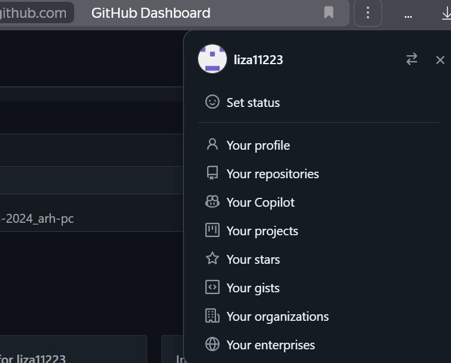{#fig:001 width=70%}

## Базовая настройка Git

Сначала делаю предварительную конфигурацию git. Открываю терминал и ввожу следующие команды: git config –global user.name ‘’, указывая  свое имя пользователя, а затем git config – global user.email ‘’, указывая свою почту(рис. [-@fig:002]).

{#fig:002 width=70%}

Далее настраиваю utf-8 в выводе сообщений git, задаю имя начальной ветки (master), далее использую параметр autocrlf и safecrlf(рис. [-@fig:003]).

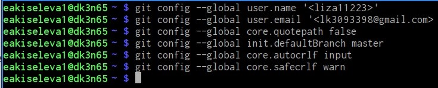{#fig:003 width=70%}

## Создание SSH-ключа

Для последующей идентификации пользователя на сервере репозиториев я сгенерировала пару ключей: приватный и открытый (рис. [-@fig:004]).

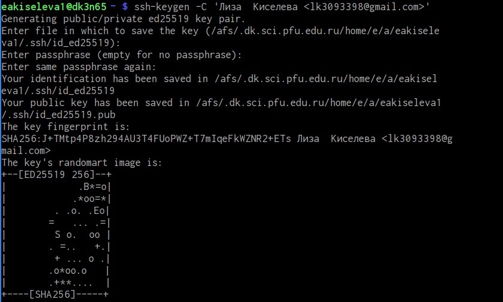{ #fig:004 width=70% }

Далее копирую открытый ключ из директории, в которой он был сохранен, с помощью команды xclip (рис. [-@fig:005]).

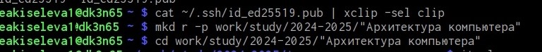{ #fig:005 width=70% }

Далее захожу на сайт GitGub, открываю свой профиль и выбираю страницу “SSH and GPG keys”. Нажимаю на кнопку “New SSH key”, вставляю в поле скопированный ключ, в поле ‘Title’ указываю имя ключа, затем нажимаю “Add SSHkey”. (рис. [-@fig:006]).

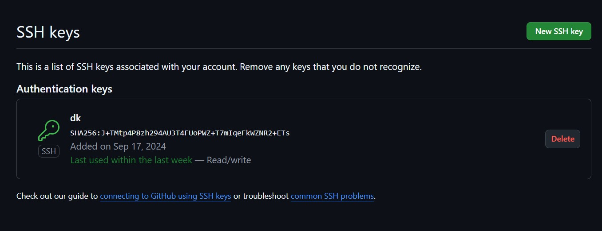{ #fig:006 width=70% }

## Создание рабочего пространства и репозитория курса на основе шаблона

Открываю терминал, создаю директорию, рабочее пространство с помощью утилиты mkdir, с помощью ключа –p создаю рекурсивно все директории после домашней ~/work/study/20242025/”Архитектура компьютера” (рис. [-@fig:007]) 

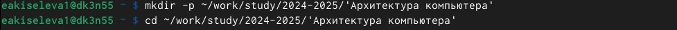{ #fig:007 width=70% }

В браузере перехожу на страницу репозитория с шаблоном курса по адресу https://github.com/yamadharma/course-directory-student-template, выбираю use this template, чтобы использовать данный шаблон для своего репозитория. В открывшемся окне задаю название репозитория: study_2024-2025_arch-pc и создаю репозиторий, нажимая на кнопку “Create repository” (рис. [-@fig:008])

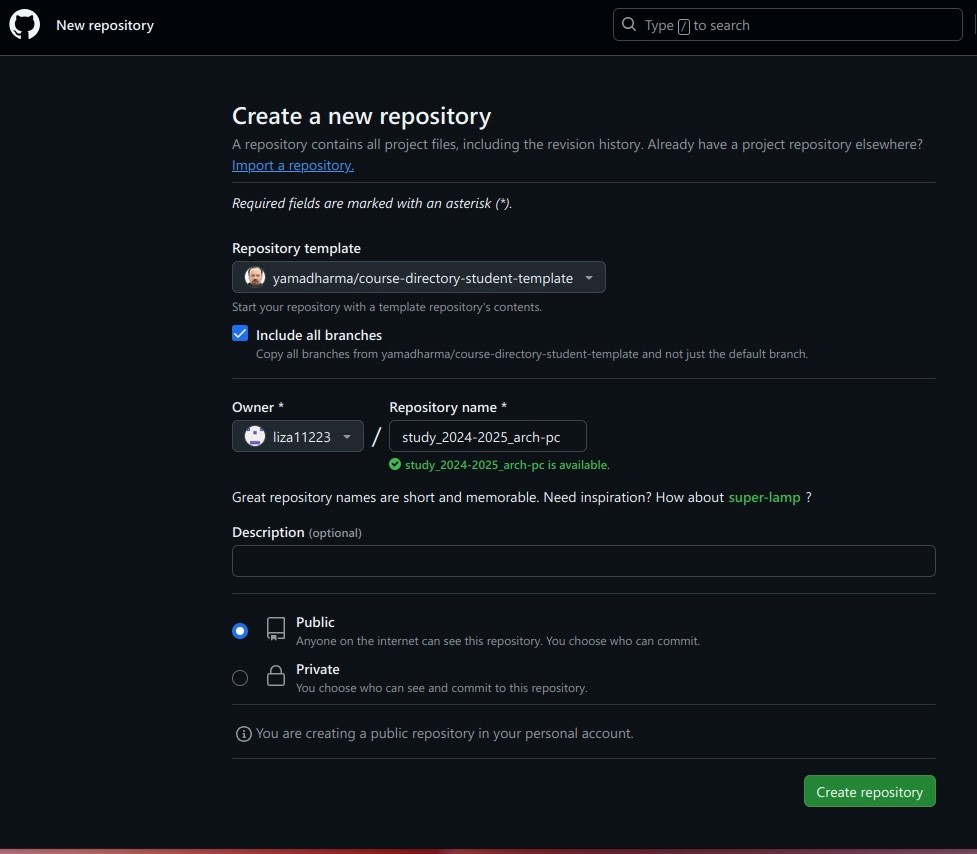{ #fig:008 width=70% }

Через терминал перехожу в созданный каталог курса с помощью утилиты cd (рис. [-@fig:009])

{ #fig:009 width=70% }

Далее клонирую созданный репозиторий (рис. [-@fig:010]).

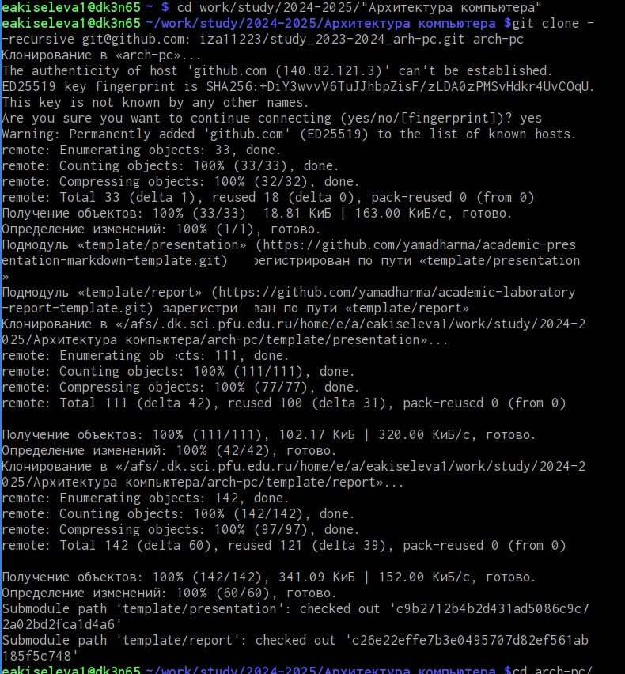{ #fig:010 width=70% }

Ссылку для клонирования копирую на странице созданного репозитория, перейдя сначала в окно ‘code’, выбрав затем вкладку ‘SSH’ (рис. [-@fig:011]).

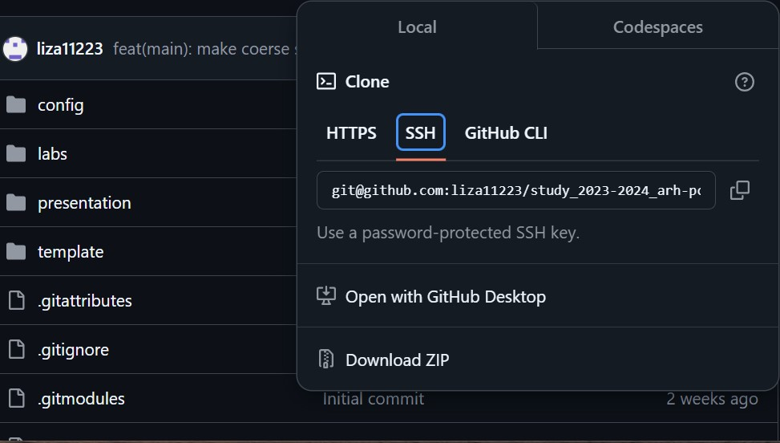{ #fig:011 width=70% }

## Настройка каталога курса

Перехожу в каталог arch-pc с помощью утилиты cd и удаляю лишние файлы с помощью утилиты rm (рис. [-@fig:012]).

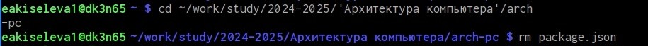{ #fig:012 width=70% }

Затем все отправляю на сервер с помощью команды git push (рис. [-@fig:013]).

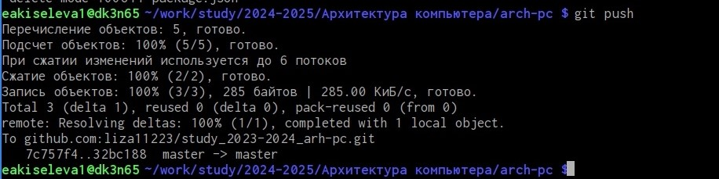{ #fig:013 width=70% }

## Выполнение заданий для самостоятельной работы

Перехожу в директорию labs/lab02/report и создаю в каталоге файл для отчета по второй лабораторной работе с помощью команды touch (рис. [-@fig:014]).

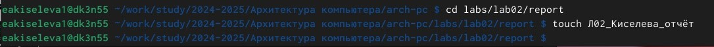{ #fig:014 width=70% }

# Выводы

При выполнении данной лабораторной работы я изучила практические навыки по работе с системой Git, также изучила применение и идеологию средств контроля версий. 

# Список литературы{.unnumbered}

1. [Архитектура ЭВМ](https://esystem.rudn.ru/pluginfile.php/1584622/mod_resource/content/1/%D0%9B%D0%B0%D0%B1%D0%BE%D1%80%D0%B0%D1%82%D0%BE%D1%80%D0%BD%D0%B0%D1%8F%20%D1%80%D0%B0%D0%B1%D0%BE%D1%82%D0%B0%20%E2%84%963.pdf)
2. [Git - gitattributes Документация](https://git-scm.com/docs/gitattributes)
